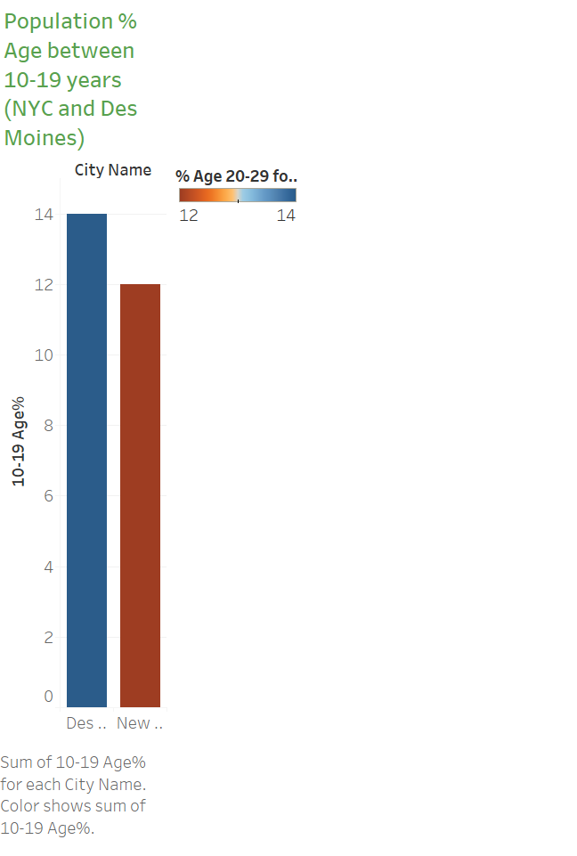
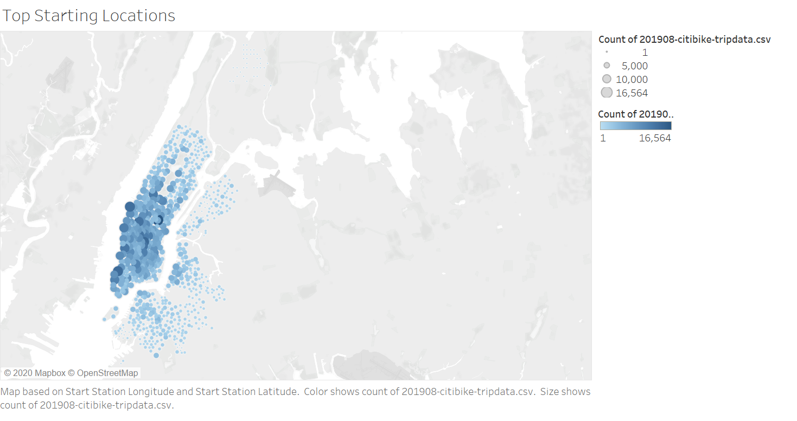

# NYC Citi Bike Analysis to help build module for Des Moines
This is a summary of the analytic work that I did with the NYC Citi Bike data. According to https://www.bikeleague.org/, from 2000 to 2016 bicyle commuting has seen 51% growth nationwide.

## Question: How population of city and people's age and number of bike riders are connected
### Age and Biking
According to US Census Bureaue younger worker in the cities are more likely to to bike to work. NYC data shows that more people are biking from age 18-65.

Even NYC population is much more than Des Moines, but number of people per sq miles are almost same according to censusreporter.org.

Data shows that youger populations average tripduation is more than older population.

Des Moines has more younger population as compared with NYC. This information is taken from census.gov

### Popular location
NYC data shows that if bike stop (pickup/return) is at popular location then people are tend to use more bikes. Des Moines also has many popular tourist destination and having bike stop (pickup/return) will increase the chances of number poeple riding the bike. https://www.catchdesmoines.com/things-to-do/ there are many populat tourist destnations example Greater Des Moines Botanical Garden, Blank Park Zoo, Outdoor Trails ect.

### Peak Hours
NYC data shows that around 5-7pm are peak bike riding hours. If more bikes combine with popular location during this peak hours will help people to prefer bike to save commute time.
[peak_hours](images/peak_hours.png)

We Also can use peak hour information for bike repair time. NYC Data shows that bikes used more required frequent repair.
[repair](images/bike_utilization.png)

## Story Links
* NYC Tableau Story
    * https://public.tableau.com/profile/girija2769#!/vizhome/biking_tableau/NYCBikeShare?publish=yes
* Des Moines Tableau 
    * https://public.tableau.com/profile/girija2769#!/vizhome/biking_tableau/Pupulation?publish=yes

## Citation
* https://www.census.gov/library/stories/2019/05/younger-workers-in-cities-more-likely-to-bike-to-work.html
* https://www.bikeleague.org/sites/default/files/LAB_Where_We_Ride_2016.pdf
* https://censusreporter.org/
* https://www.catchdesmoines.com/things-to-do/

